# Определение сети
	- Сеть - это совокупность автономных вычислительных устройств, связанных (общающихся) с помощью одной технологии.
- # 1.3 Сетевые технологии
	- **PAN (Personal Area Network)** - технологии, связывающие устройства, используемые одним человеком.
		- Пример *PAN*:
		- - Bluetooth -  связывает компьютер с периферийными устройствами.
	- **LAN (Local Area Network)** - технологии, связывающие устройства в отдельном здании или на прилегающей территории.
		- Примеры *LAN*:
		- - Ethernet - устройства подключаются проводами к общему коммутатору.
		- - Wi-Fi - беспроводная LAN (WLAN) с маршрутизатором, сделанная по стандарту IEEE 802.11
	- **MAN (Metropolitan Area Network)** - технологии, охватываюшие соединением целый город.
		- Пример *MAN*:
		- - Кабельное ТВ
	- **WAN (WIde Area Network)** - технологии, охватвающие значительные географические расстояния, например, континент или страну.
		- WAN состоит из **хостов (hosts)** - конечные точки соединения (компьютеры) и **подсети (subnet)** - то, что осуществляет передачу (т.е. всё остальное).
		- Подсети зачастую состоят из **линий передач (transmission lines)** и **коммутаторов (switches)**, определяющих куда направлять пакеты.
		- Большинство WAN состоят из линий передач, соединяющих **маршрутизиторы (routers)**.
		- Подсеть как набор линий передач, коммутаторов и маршрутизаторов - устаревшее понятие. Недавно оно приобрело более актуальное значение (см. главу 5).
	- **SD-WAN (Software-defined WAN)** - технологии WAN, в которых за оптимальную маршрутизацию отвечают программируемые коммутаторы и отдельные программы.
- # Определение интернета
	- **Интернет (объединенная сеть)** - совокупность связанных (общающихся) сетей, использующих различные тезхнологии.
		- В объединённах сетях используются **шлюзы (gateway)** выполняющие преобразования пакетов от одной технологии к другой.
		- Объединение, например, LAN и WAN может считаться интернетом.
- # 1.4 Примеры сетей
	- ## История интернета
		- ## ARPA
			- 1950-е годы, жесть холодная война, все военники общаются по телефонным линиям, которые очень ненадежно построены *(рис. а)*. Минобороны попросила у одной корпорации придумать че получше, и Пол Бэран придумал отказоустойчивую схему *(рис. б)*. Но по ней аналоговые сигналы жесть с помехами будут приходить, потому что далеко надо идти, и Бэран предложил цифровые коммутаторы.
			- Эту задачу отдали на разработку AT&T, они мозгами пораскинули и сказали вы ебанутые жесть это вообще невозможно.
				- 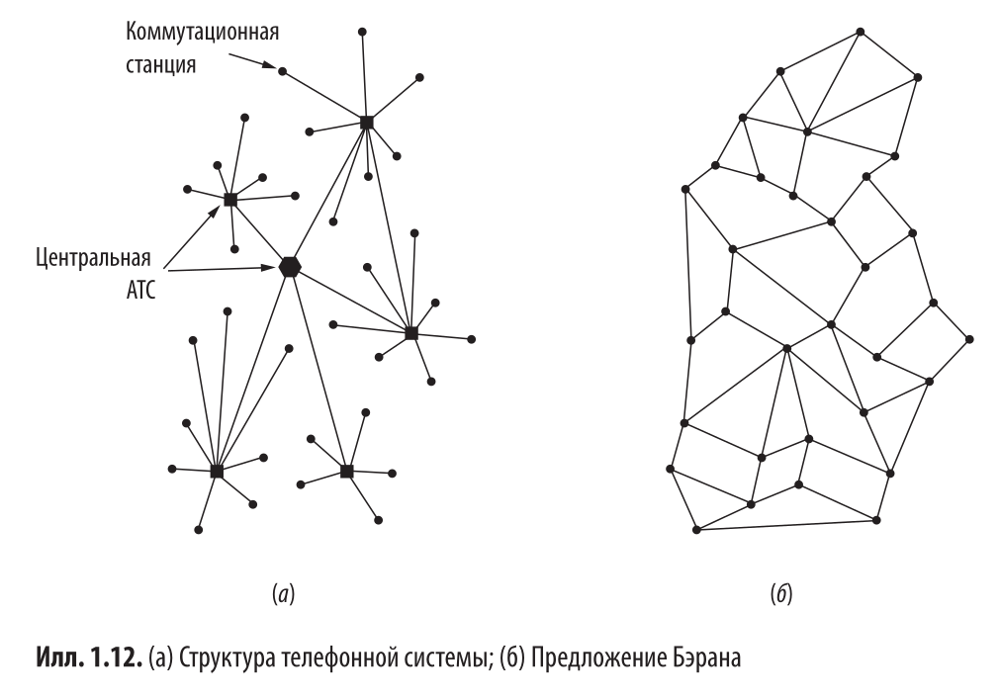{:height 535, :width 838}
			- А в 1967 г. **ARPA** придумали **ARPANET**. В этой разработке вся подсеть состояла из мини компьютеров **IMP (Interface Management Processors)** и 56-килобитных линий. В пакете передавали полный адрес назначения, поэтому ниче не терялось (креветки круто). У каждого хоста был свой IMP.
			- Осталось только сделать, написать там ПО и протоколы хост-IMP, IMP-IMP, хост-хост. В итоге в 1969 г. проложили такую сеть между 4 университетами.
			- Только была проблема - технология не работала с разными протоколами, поэтому ARPA проспонсировала изобретение так называемого **TCP/IP** (протокол для internet) который работает на основе нового интерфейса **socket**.
		- ## NSF
			- Чтобы подключиться к ARPA надо было заключать контракт с минобороны, но это могли позволить не все. Поэтому NSF в 1980-х разработали свою сеть на арендованных линиях и сразу на TCP/IP. Было 6 суперкомпьютеров в ключевых точках, к которым подключались через роутер **fuzzball**.
			- NSF создали контракт с 4 корпорациями в разных городах на создание точек доступа (NAP - Network Access Point).  Любой, кто хотел предоставлять услуги опорной сети в регионе должен был подключаться ко всем точкам сразу -> конкуренция, рыночек, рост качества (креветки круто).
	- ## Архитектура интернета
		- 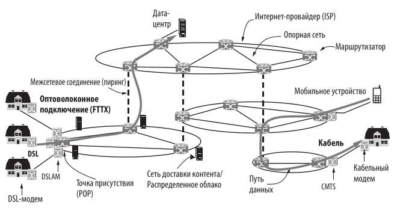
		- **Опорная сеть (backbone)** - основные магистрали, соединяющие ключевые стратегические точки.
		- **Модем** (модулятор/демодулятор) - устройство преобразующее цифровое битовое представление в аналоговый сигнал и наоборот.
		- **CMTS** - Cable Modem Termination System (система окончания кабельных модемов).
		- **FTTH** - FIber To The Home (оптоволокно в дом).
		- **ISP** - Internet Service Provider
		- Место входа пакетов пользователя в сеть провайдера - **POP** (Point of Presence)
		- Провайдеры связывают свои сети в **IXP** (Internet eXchange Point) - это называется **peering**.
	- ## 1.4.2 Архтектура мобильной сети
		- 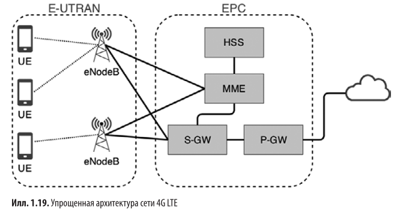
			- **UMTS** -  Universal Mobile Telecommunication System
			- **E-UTRAN** - Evolved UMTS Terrestrial Radio Access Network (короче усовершенствованное+беспроводное)
			- **eNodeB** -  сотовая базовая станция - образует сеть беспроводного доступа
			- **Ядро сети** - всё остальное помимо сети беспроводного доступа
			- **EPC** - Evolved Packet Core (пакетное ядро)
			- **S-GW** - Serving netwotk Gateway (отвечает за обслуживание)
			- **P-GW** - Packet data Gateway (отвечает за обмен данными)
			- Когда пользователь выходит из радиуса действия одной базовой станции,  поток данных перенаправляется на другую - **передача обслуживания (handover)**. Для этого HSS отслеживает местоположение каждого абонента.
			- **HSS** - Home Subscriber Service (сервер абонентских данных)
			- В целях безопасности придумали SIM карты.
			- ## Коммутация пакетов и каналов
			- Коммутация пакетов (packet switching) - на маршрутизатор отправляются пакеты, если он получил слишком много, какие-то теряются.
				- - Легче поддерживать качество.
			- Коммутация каналов (circuit switching) - набираешь номер и ждёшь пока возьмут. Устанавливается канал передачи и он поддерживается, пока вызов не завершится.
				- - Ничего не теряется.
			- ### 1G, 2G, 3G
			- Сотовая связь (жесть реально соты) - так сделали, чтобы легче было переключаться между базовыми станциями, когда чел с телефоном идёт и выходит из зоны действия одной станции и заходит в зону действия другой.
			- 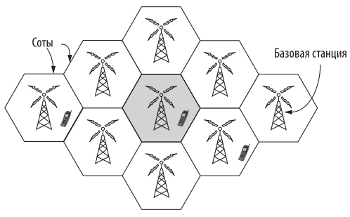
	- ## 1.4.3 Беспроводные сети (Wi-Fi)
		- Wi-Fi - стандарт LAN под номером 802.11, созданный IEEE.
		- Когда устройство раздаёт сигналы, некоторые из них могут отражаться и заглушать или усиливать другие - происходит потеря данных. Это называется **многолучевым замиранием (multipath fading)**.
		- Эта проблема решалась с помощью **разнесения путей (path diversing)** - используются разные частоты, биты повторяются через неравные промежутки времени.
		- - Это оказалось очень медленно.
		- Позднее стандарты были переведены на схему **OFDM (Orthogonal Frequency Division Multplexing - мультипллексирование с ортогональным частотным разделением каналов)**
		- Есть проблема безопасности - все получают все пакеты, даже не предназначенные для них.
		- Решение: система шифрования **WPA (Wi-Fi Protected Access)**
- # 1.5 Сетевые протоколы
	- ## 1.5.1 Цель разработки
		- logseq.order-list-type:: number
		  1. Надежность:
			- Один из механизмов -  **error detection** - если получены неправильные биты, пакет отправляется заново.
			  logseq.order-list-type:: number
			- Другой механизм - **error correction** -  правильное сообщение восстанавливается на основе неправильного.
			  logseq.order-list-type:: number
			- Оба метода требуют добавления избыточной информации в сообщение.
			  logseq.order-list-type:: number
			- Другая задача обеспечения надёжности - поиск работоспособного пути передачи данных **(маршрутизация)**.
			  logseq.order-list-type:: number
		- logseq.order-list-type:: number
		  2. Распеределение ресурсов
			- Часто пропускная способность делится между хостами динамически.
			  logseq.order-list-type:: number
			- Также есть проблема - как не допустить, чтобы быстрый отправитель не перегрузил медленного получателя. В этом случае используется обратная связь от получателя. Производится **flow control**.
			  logseq.order-list-type:: number
		- logseq.order-list-type:: number
		  3. Способность к развитию
			- С течением времени возникает потребность подключения новых элементов.
			  logseq.order-list-type:: number
			- Ключевой механизм поддержки изменений - **protocol layering (разделение протокола на уровни)**.
			  logseq.order-list-type:: number
			- Механизм идентификации отправителей и получателей - **addressing (адресация)** (на низшем уровне) и **naming (именование)** (на высшем уровне).
			  logseq.order-list-type:: number
			- Механизм разбиения сообщений на части - **internetworking (механизм межсетевого взаимодействия)**.
			  logseq.order-list-type:: number
		- logseq.order-list-type:: number
		  4. Безопасность
			- Используются механизмы обеспечения секретности информации, аутентификации и целостности.
			  logseq.order-list-type:: number
			-
	- ## 1.5.2 Разделение протокола на уровни
		- Каждый уровень построен на основе нижележащего. Задача каждого уровня - предоставление служб высшим уровням и сокрытие от них деталей реализации этих служб (короче обычная инкапсуляция).
		- Протокол - соглашение о том, как должно происходить взаимодействие.
		- 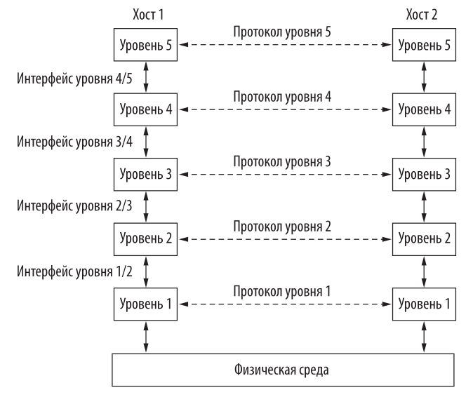
			- пунктир - виртуальный обмен информацией
			  сплошная линия - фактический обмен информацией
		- Сущности, образующие уровни на различных компьютерах называются **пирами (peers)**.
		- Каждая пара смежных уровней связана интерфейсом.
		- Набор уровней и протоколов - **архитектура сети**.
		- Список используемых конкретной системой протоколов - **стек протоколов**.
		- ### Пример использования пятиуровневой архитектуры:
			- Процесс, работающий на уровне 5 генерирует сообщение M и отдаёт его на уровень 4.
			- На уровне 4 перед сообщением вставляют **заголовок (header)** для его идентификации, разбивают и передают на уровень 3.
			- Уровень 3 включает управляющую информацию (например, адрес, размер, метки времени) в каждую часть сообщения и передаёт на уровень 2.
			- Уровень 2 добавляет в каждую часть сообщения заголовок и окончание и отдаёт уровню 1 для физической передачи.
			- 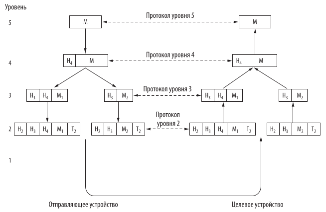
	- ## 1.5.3 Соединения и надежность
	  logseq.order-list-type:: number
		- Службы, лежащие ниже, предоставляют высшим уровням два типа служб - **с соединением** и **без соединения**.
		  logseq.order-list-type:: number
		- ### Службы, ориентированные на установление соединения
		  logseq.order-list-type:: number
			- connection oriented service - работают по принципу телефонных сетей. Соединение устанавливается, затем используется, затем освобождается. Биты обычно приходят в том порядке, в котором были отправлены.
			  logseq.order-list-type:: number
		- ### Службы без установления соединения
		  logseq.order-list-type:: number
			- Работают по принципу почты -  каждый пакет содержит полный адрес назначения и проходит через промежуточные узлы.
			  logseq.order-list-type:: number
			- **store-and-forward switching** (коммутация с промежуточным хранением данных) - узел дожидается весь пакет и отправляет только после.
			  logseq.order-list-type:: number
			- **cut-through switching** (сквозная коммутация) - узел передаёт пакет далее вплоть до полного получения.
			  logseq.order-list-type:: number
			- logseq.order-list-type:: number
			- **datagram service** - пакет получается без потдверждения (по аналогии с телеграммом, например - эл. почта).
			  logseq.order-list-type:: number
		- ### Надежность
		  logseq.order-list-type:: number
			- **Надежная служба** - адресат подтверждает получение сообщения.
			  logseq.order-list-type:: number
			- **Поток сообщений** - между сообщениями есть границы.
			  logseq.order-list-type:: number
			- **Байтовый поток** - между сообщениями нет границ (если пришло 2048 байт, нельзя понять, это одно или два по 1024).
			  logseq.order-list-type:: number
			- **Датаграмма с подтвеждением получения** - соединение не устанавливается, просто отправляется сигнал обратно, что получили.
			  logseq.order-list-type:: number
			- **Запрос/ответ** - датаграмма туда и обратно.
			  logseq.order-list-type:: number
			- 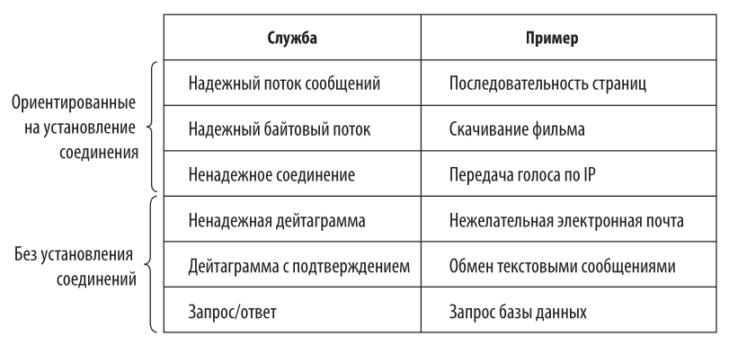
			  logseq.order-list-type:: number
	- ## 1.5.4 Примитивы служб
	  logseq.order-list-type:: number
		- **Примитив** - операция службы, доступная обращающимся к ней пользовательским процессам.
		  logseq.order-list-type:: number
		- С помощью примитивов указывают службе что делать. Обычно это системный вызов.
		  logseq.order-list-type:: number
		- **Минимальный набор примитивов:**
		  logseq.order-list-type:: number
			- LISTEN - блокирующее ожидание входящего соединения
			  logseq.order-list-type:: number
			- CONNECT - установка соединения с находящимся в ожидании одноранговым процессом
			  logseq.order-list-type:: number
			- ACCEPT - принятие входящего соединения от однорангового процесса
			  logseq.order-list-type:: number
			- RECIEVE - блокирующее ожидание входящего сообщения
			  logseq.order-list-type:: number
			- SEND - отправка сообщения
			  logseq.order-list-type:: number
			  DISCONNECT - завершение соединения
		- **Пример службы запрос/ответ:**
		  logseq.order-list-type:: number
			- Процесс на сервере выполняеет LISTEN и блокируется.
			  logseq.order-list-type:: number
			- Процесс на клиенте выполняет CONNECT (указывает адрес сервера), операционная система отправляет пакет с запросом на соединение;
			  logseq.order-list-type:: number
			- ОС на сервере видит пакет с запросом и проверяет, слушает ли кто-то. Если да, то разблокирует его и процесс на сервере выполняет ACCEPT. ОС посылает пакет клиенту. Процесс на сервере сразу же выполняет RECIEVE (до того, как клиент получил добро) и снова блокируется;
			  logseq.order-list-type:: number
			- Процесс на клиенте выполняет SEND, затем сразу RECIEVE и блокируется.
			  logseq.order-list-type:: number
			- Процесс на сервере разблокируется, вызывает SEND.
			  logseq.order-list-type:: number
			- Процесс на клиенте разблокируется и выполняет DISCONNECT.
			  logseq.order-list-type:: number
			- Сервер получает пакет об окончании и тоже вызывает DISCONNECT.
			  logseq.order-list-type:: number
			- 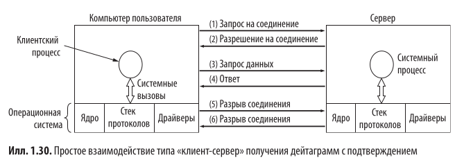
			  logseq.order-list-type:: number
			- Таким образом, на два сообщения - 6 пакетов.
			  logseq.order-list-type:: number
	- ## 1.5.5 Службы и протоколы
	  logseq.order-list-type:: number
		- **Службы** - это набор примитивов (операций), которые нижележащий уровень может делать для вышележащего.
		  logseq.order-list-type:: number
		- **Протокол** - напротив, набор правил, определяющих формат и смысл пакетов, которыми обмениваются сущности внутри одного уровня.
		  logseq.order-list-type:: number
		- 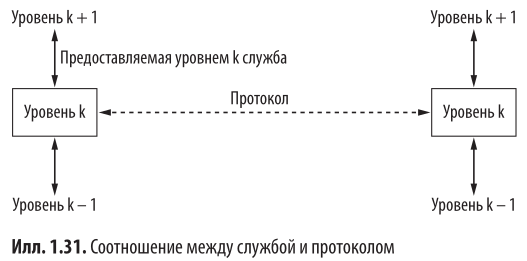
		  logseq.order-list-type:: number
		-
		- logseq.order-list-type:: number
- # 1.6 Эталонные модели
	- ## 1.6.1 OSI
		- Разработана ISO. Расшифровывается как Open System Interconnection.
		- Состоит из 7 уровней.
		- Каждый уровень выделен в соответствии с принципами:
			- - Каждый уровень соответствует отдельной абстракции
			- - Все уровни выполняют четко определенные функции
			- - Функция каждого уровня выбирается в соответствии с учетом создания в дальнейшем международных стандартизированных протоколов
			- - Границы уровней должны выбираться так, чтобы минимизировать поток информации через интерфейсы
			- - Количество уровней не должно быть слишком низким, чтобы не приходилось собирать разные функции в одном уровне; но нельзя, чтобы их было слишком много, иначе архитектура будет громоздкой
		- Центральные понятия: ***служба***, ***интерфейс***, ***протоколы***
		- 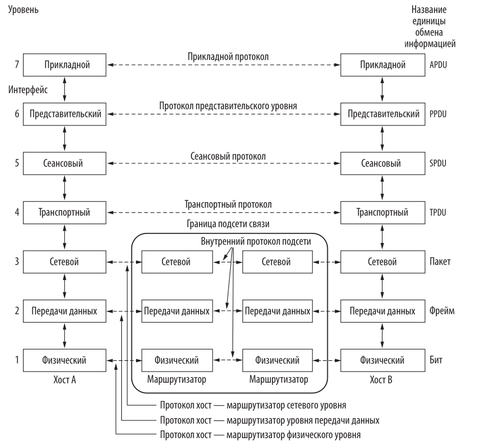
	- ## 1.6.2 TCP/IP
		- Использовалась в ARPANET.
		- ### Канальный уровень (link layer)
			- Низший уровень, описывает какимы должны быть каналы связи (например, Ethernet) для удовлетворения потребностей соединения.
		- ### Межсетевой уровень (internet layer)
			- Его задача - сделать так, чтобы хосты могли внедрять пакеты в произвольную сеть. Определяет официальный формат пакетов **IP (Internet Protocol)** и вспомогательный **ICMP (Internet Control Message Protocol)**.
		- ### Транспортный уровень (transport layer)
			- Задача - обеспечение связи объектов одного ранга, расположенных на разных хостах.
			- В нём определено два транспортных протокола
				- **TCP (Transmission Control Protocol)** - надежный, ориентированный на установление соединения
				- **UDP (User Datagram Protocol)** -  ненадежный, без соединения
		- ### Прикладной уровень (application layer)
			- Высокоуровневые протоколы
				- **HTTP (Hypertext transfer protocol)** - для веб-страниц
				- **DNS (Domain name system)** - устанавливает соответствие между доменными именами и адресами
				- **RTP (Real-time transfer protocol)** - доставка мультимедиа
		- 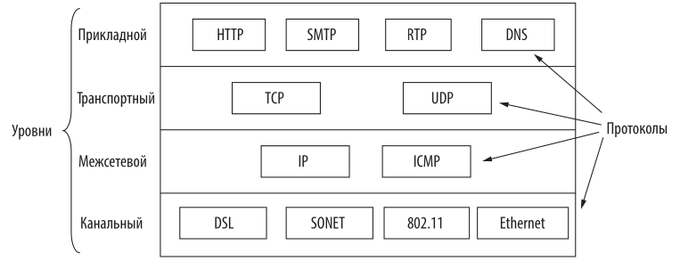
			-
			-
	- **Там в книге есть ещё два душных параграфа про критику моделей**
- # 1.7 Стандартизация
	- ## 1.7.1 Стандартизация и опенсорс
		- Стандарт описывает **что требуется для совместимости с другими продуктами** - ни больше, ни меньше.
		- Например, стандарт 802.11 (Wi-Fi) описывает несколько скоростей передачи данных, при этом не указывается, какие скорости когда использовать.
		- Стандарт задаёт протокол передачи данных, но не внутренний интерфейс - чтобы передать на удалённый хост что-то по TCP/IP не имеет значения, как уровень TCP общается с уровнем IP (такие вещи защищены патентом).
		- Стандарты бывают де-факто и де-юре
			- де-факто - возникли сами собой и приобрели популярность (например HTTP)
			- де-юре -  кто-то придумал, например IEEE или ISO
	- **Далее три душных параграфа про то, кто есть кто, какие корпорации чем занимаются и какую роль играют. Если интересно, смотри книжку**
	-
	-
- **1.8 - душная глава про политические, правовые и социальные проблемы (свобода слова, дезинформация, безопасность, приватность). Смотри книжку**
-
- [[Вопросы к главе 1]]