- Три вида сред передачи - проводные (кабельные), беспроводные и спутниковые.
- # 2.1 Проводные среды передачи данных
	- ## 2.1.1 Запоминающее устройство
		- Танненбаум приводит расчёт, где показывает, что грузовик, набитый дисками обладает намного большей пропускной способностью (десятки Тбит/сек) и меньшей стоимостью (0.5 цента за Гб), чем интернет. Но задержка, конечно, злоебучая...
	- ## 2.1.2 Витая пара (twisted pair)
		- Два медных провода толщиной около 1мм скручены как ДНК. Два параллельных провода образовали бы антенну, а когда они скручены, их сигналы взаимно гасятся.
		- Сигнал передаётся как разность потенциалов между этими проводами. Поскольку внешние шумы влияют на оба провода примерно одинаково, такая схема устойчива к шуму.
		- В основном их используют для телефонных линий.
		- 100-мегабитный кабель Ethernet использует две витые пары для каждого направления.
		- 1-гигабитный кабель Ethernet использует 4 витые пары.
		- Категории кабелей:
			- **полнодуплексный (full-dulplex) кабель** - в любой момент времени может передавать в оба направления.
			- **полудуплексный (half-duplex) кабель** - в конкретный момент времени передаёт только в одном направлении.
			- **симплексный (simplex) кабель** - всегда передаёт только в одном конкретном направлении.
	- ## 2.1.3 Коаксильный кабель (coaxial cable)
		- Лучше экранирован (защищен от внешнего воздействия и шумов) и обладает более широкой полосой пропускания (диапазоном частот, в пределах которых сигнал доходит без помех). Подходит для передачи на большие расстояния и с большей скоростью.
		- 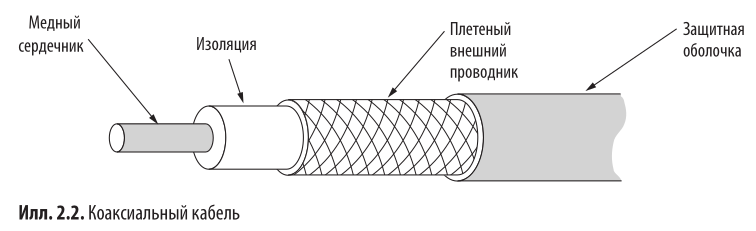
	- ## 2.1.4 ЛЭП
		- Идея - включил телек в розетку и фильм передаётся через розетку.
		- Проблема - электричество передаётся на частоте 50-60 Гц, а для высокоскоростного обмена данными необходимо > 1 МГц.
		- Без аккуратного скручивания, как у витой пары, проводка ведёт себя как антенна, поэтому надо избегать лицензированных частот (например тех, на которых работает радио). Иначе будут помехи.
		- В целом хуета, но всё-таки можно передавать со скоростью до 500Мбит/сек и кто-то даже это делает.
	- ## 2.1.5 Оптоволокно
		- Потенциальная пропускная способность - 50000 Гбит/сек.
		- Реальный потолок на сегодняшний день - 100 Гбит/сек (потому что мы не умеем быстро преобразовывать электрический сигнал в световой).
		- Симплексное оптоволокно состоит из генератора света, сверхтонкого стекловолокна и и приёмника.
			- Проблема - потеря света при передаче (он просто выходит наружу).
			- Решение - свет на границе преломляется, поэтому если взять очень большой угол, то он будет преломляться вовнутрь и не выходить.
			- 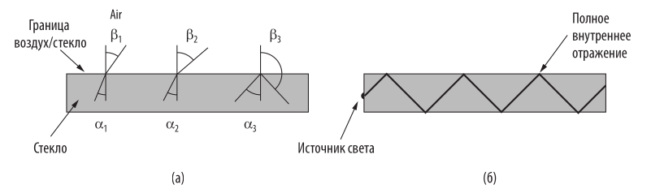
		- Если разные лучи отражаются под разным углом, то говорят, что они имеют разные **моды**. Соответственно, волокно - **многомодовое (multimode fiber)**.
		- Если уменьшить диаметр волокна до нескольких длин волны света (менее 10 мкм), волокно станет **волноводом** (т.е. свет распространяется в нём только по прямой). Волокно - **одномодовое (single-mode fiber)**.
		- Одномодовые передают на расстояние в 50 раз больше, чем многомодовые, но они дороже.
			- ### Передача света через оптоволокно
				- Свет имеет свойство затухать при прохождении через оптоволокно, и есть график затухания (Дб/км) от длины волны (мкм). Используют в основном свет с длиной волны 0.85, 1.30, 1.55 мкм, потому что это локальные минимумы затухания.
			- ### Оптоволоконные кабели
				- Состоит из стеклянного сердечника (диаметр около 50мкм -  как человеческий волос). Сердечник окружен стеклянным покрытием с более низким коэффициэнтом преломления. Вокруг стеклянного покрытия пластик.
				- Для соединения оптоволоконных кабелей используют коннекторы (оптические розетки), либо сращивание (их совмещают и фиксируют), либо сварку.
				- Для генерации световых сигналов используют светодиоды или полупроводниковые лазеры.
			- ### Сравнение оптоволокна и медных проводов
				- Оптоволокно обладает меньшим затуханием: медным проводам нужен повторитель каждые 5км, а оптоволокну - каждые 50км.
				- Ещё оно легче и не допускает утечек света -> сложнее несанкционированное подключение.
				- Понятно, что волокно дороже и сложнее в изготовлении.
- # 2.2 Беспроводная передача данных
	- ## 2.2.2 Псевдослучайная перестройка частоты
		- Передатчик меняет частоту сотни раз в секунду. Такую передачу трудно засечь и заглушить. Также снижается замирание сигнала.
		- Эту технологию придумала австрийская актриса Хеди Ламар, чтобы помочь победить Гитлера.
- # 2.3 Применение спектра электромагнитных волн для передачи данных
	- ## 2.3.1 Радиосвязь
		- Радиоволны далеко передаются и проходить сквозь стены.
		- Чем выше частота волны, тем меньше она проходит сквозь препятствия и больше отражается.
		- 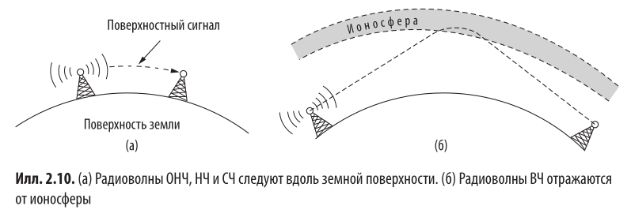
	- ## 2.3.2 Микроволновая связь
		- На частоте выше 100 МГц волны идут практически по прямой. Передача происходит с помощью параболических антенн, направленных друг на друга.
		- Они дешёвые, но плохо проходят через здания.
	- ## 2.3.3 Инфракрасный диапазон
		- Простые в изготовлении, дешёвые, но сигнал не проходит через плотные объекты (вообще).
		- В инфракрасном диапазоне делают пульты управления.
	- ## 2.3.4 Видимый диапазон
		- Используется для соединения двух LAN на крышах зданий. Сигнал передаётся с помощью лазера и датчика.
		- Проблема - в жаркий день горячий воздух становится турбулентным (делает ъеъеъъе ~~~~)  и лазер не попадает в датчик.
- # 2.4 Передача битов
	- ## 2.4.1 Теоретические основы передачи данных
		- ### Гармонический анализ
			- Жан-Батист Фурье доказал, что любую периодическую функцию можно [разложить в сумму тригонометрических](https://ru.wikipedia.org/wiki/Тригонометрический_ряд_Фурье):
			- $$g(x) = \frac{1}{2}c + \sum_{n=0}^{\infty}(a_n sin(2\pi nfx) + b_n cos(2\pi nfx))$$
			- Где $f = \frac{1}{T}$ - частота, $с$ - среднее значение функции, $a_n$ и $b_n$ - амплитуды n-х гармоник функции.
			- Известно, что
			- $$\int_{-\pi}^{\pi}sin(2\pi fkx)sin(2\pi fnx) = \begin{cases}
			     0 &\text{, } n \neq k \\
			     T/2 &\text{, } n = k
			  \end{cases}$$
			- $$\int_{-\pi}^{\pi}sin(2\pi fkx)cos(2\pi fnx) = \begin{cases}
			     0 &\text{, } n \neq k \\
			     T/2 &\text{, } n = k
			  \end{cases}$$
			- $$\int_{-\pi}^{\pi}cos(2\pi fkx)cos(2\pi fnx) = \begin{cases}
			     0 &\text{, } n \neq k \\
			     T/2 &\text{, } n = k
			  \end{cases}$$
			- Поэтому можно получить амплитуды домножением и интегрированием (всё занулится, кроме нужного)
			- $$a_n = \int_{-\pi}^{\pi}g(x)sin(2\pi fnx)dx$$
			- $$b_n = \int_{-\pi}^{\pi}g(x)cos(2\pi fnx)dx$$
		- ### Сигналы с ограниченным диапазоном частот
		  collapsed:: true
			- Рассмотрим задачу передачи ASCII-символа 'b'. В 8-битном виде это 01100010.
			- 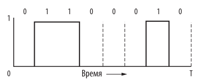
			- При гармоническом разложении сигнала получаются коэффициенты:
			- $$a_n  = \frac{1}{\pi n}[cos(\pi n / 4) - cos(3\pi n / 4) + cos(6\pi n / 4) - cos(7\pi n / 4)]$$
			- $$b_n  = \frac{1}{\pi n}[sin(3\pi n / 4) - sin(\pi n / 4) + sin(7\pi n / 4) - sin(6\pi n / 4)]$$
			- Ширина диапазона частот называется **шириной полосы пропускания** или **пропускной способностью (bandwidth)**.
			- Пропускную способность фильтруют. Например, в 802.11 используется диапазон 20 МГц. Телевизионные каналы занимают диапазоны в 6 МГц каждый,
			- Передаваемая информация зависит только от ширины полосы, а не от начальной и конечной частоты.
			- Если бы сигнал ASCII-символа 'b' использовал только самые низкие частоты, сигнал бы выглядел так:
			- 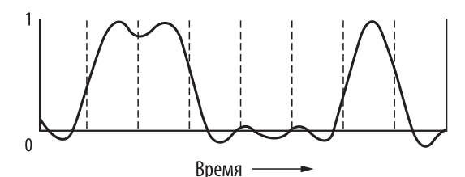{:height 155, :width 384}
	- ## 2.4.2 Максимальная скорость передачи данных по каналу
		- ### Теорема Найквиста-Шеннона-Котельникова
			- > Любой аналоговый сигнал с полосой пропускания B (т.е. частоты от 0 до B) можно полностью восстановить, производя 2B дискретных измерений в секунду.
			- То есть, если известно, что функция разложилась в ряд Фурье с частотами от 0 то B, то её можно узнать по 2B пробным точкам.
			- Из этого следует, что если сигнал состоит из V дискретных уровней, то максимальная скорость передачи данных равна:
				- $$v_{max} =2B log_2V \frac{бит}{сек}$$
			- Под дискретными уровнями имеется ввиду вот это:
			- 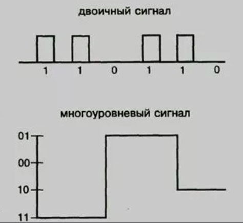{:height 346, :width 268}
		- ### Шумы
			- Предыдущее работает только для свободных от шумов каналов. При наличии шума ситуация ухудшается.
			- Объем теплового шума измеряется как отношение **сигнал/шум** $= S/N$ (то есть отношение мощности сигнала к мощности шума).
			- Обычно измеряется в децибелах, то есть указывается на логарифмической шкале: $10 log_{10}(S/N)$.
			- Основной результат, полученный Шенноном:
				- $$v_{max} = 2Blog_2(1 + S/N) \frac{бит}{сек}$$
	- ## 2.4.3 Цифровая модуляция
		- **Цифровая модуляция (digital modulation)** - процесс приобразования битов в сигналы и наоборот.
		- **Передача в базовой полосе (baseband)** - используем частоты от 0 до максимума.
		- **Передача в полосе пропускания (passband)** - используем частоты не от 0, изменяем амплитуду, фазу и частоту несущего сигнала.
		- 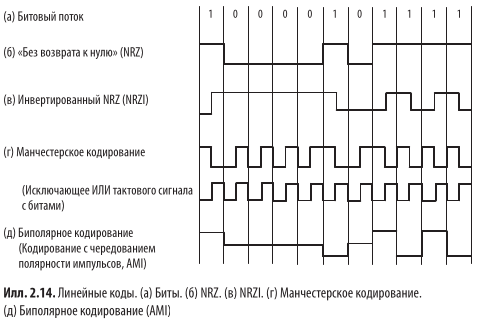{:height 367, :width 519}
		- Полезная картинка. Пояснение дальше.
		- ### Передача в базовой полосе
			- В простейшем варианте 1 кодируется положительным напряжением, а 0 - отрицательным (рис. б). Такая схема называется **NRZ (Non-Return-to-Zero)** по историческим причинам.
		- ### Эффективность полосы пропускания
			- В NRZ сигнал может перескакивать между + и - каждые 2 бита. Поэтому для передачи в $B \text{ }\frac{бит}{cек}$ требуется полоса пропускания минимум $B/2 \text{ Гц}$ (из уравнения Найквиста).
			- Полоса пропускания - ограниченный ресурс.
			- Чтобы улучшить ситуацию, можно использовать больше уровней сигнала. При 4-х уровнях один символ несёт информацию 2 бита.
		- ### Восстановление тактового (синхронизационного) сигнала
			- Проблема - приемник должен понимать, где кончается один сигнал и начинается другой (15 нулей подряд очень похожи на 16 нулей подряд).
			- **Плохое решение №1** - отправлять синхронизационные сигналы чтобы сверится (это очень медленно).
			- **Плохое решение №2** - провести ещё одну тактовую линию для синхронизационных сигналов (пойдёт для небольших шин и кабелей, но иначе это неразумные траты).
			- **Возможное решение №1** - Манчестерское кодирование (рис. г). Соединяем синхронизационный сигнал и сигнал с информацией с помощью XOR.
				- В итоге: 
				  0 = переход от "+" к "-"; 
				  1 = переход от "-" к "+".
				- Такое используют в Ethernet.
				- Проблема - нужна большая полоса пропускания (в 2 раза больше, чем при NRZ).
			- **Возможное решение №2** - NRZI (NRZ Inverted).
				- 0 - отсутствие перехода между "+" и "-".
				- 1 - переход между "+" и "-" или наоборот.
				- Такое используют в USB.
				- Решена проблема длинных последовательностей "1", но не решена проблема последотвательностей "0".
				- Решение - кодирование **4B/5B**. Каждые 4 бита кодируются 5-ю битами, чтобы избежать больше 2х нулей подряд.
				- 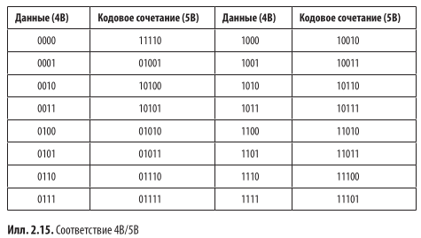
			- **Возможное решение №3** - скремблирование: генерируем случайную последовательность и делаем XOR с сигналом. Чтобы расшифровать, нужно сделать XOR с той же самой последовательностью. Обычно используют простые генераторы случайных чисел.
				- Преимущество - не требует дополнительной полосы пропускания или избыточной информации.
				- Недостаток - нет гарантий отсутствия длинных цепочек, может не повести.
		- ### Симметричные сигналы
			- **Симметричные сигналы** - сигналы, у которых доля положительного напряжения и отрицательного равны даже за короткий промежуток времени.
			- Среднее значение = 0 -> отсутствует составляющая постоянного тока. Это плюс, т.к. коаксильный кабель и линии с трансформаторами ослабляют составляющую постоянного тока.
			- Пример - биполярное соединение (рис. д):
				- 1 = чередование +1 и -1
				- 0 = всегда 0
			- Получается трехуровневое соединение.
			- При биполярном кодировании можно использовать схему **8B/10B** (аналогично 4B/5B).
				- 8 битов разделяются на 5 и 3.
				- 5-ю битам ставят в соответствие 6.
				  3-м битам ставят в соответствие 4.
			- Для поддержания баланса компоновщик может запоминать дисбаланс и выбирать какой-то из двух кодов для некоторых комбинаций. Например, 000 может соответствовать 1011 или 0100.
		- ### Передача в полосе пропускания
			- Передача в базовой полосе пропускания (от 0 до максимума) используется в проводной связи.
			- В беспроводной связи используют диапазон, не начинающийся с нуля (потому что иначе длина волны может быть сопоставима с размером антенны).
			- Задача - преобразуем несущий сигнал, чтобы он был на нужных нам частотах.
			- **ASK (Amplitude Shift Keying)** - меняем амплитуду (б)
			- **FSK (Frequency Shift Keying)** - меняем частоту (в)
			- **PSK (Phase Shift Keying)** - меняем фазу (г)
			- 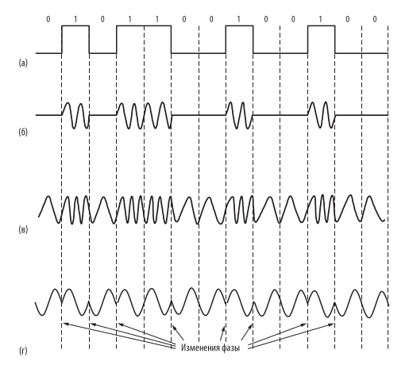{:height 491, :width 532}
	- ## 2.4.4 Мультиплексирование
		- Мультиплексирование - передача по одному каналу больше, чем одного битового потока.
		- ### Мультиплексирование с частотным разделением каналов.
			- **FDM (Frequency Division Multiplexing)** - спектр делится на несколько диапазонов и в каждом диапазоне работает логический канал связи.
			- Добавлялась дополнительная защитная полоса пропускания (guard band) для более четкого разделения.
			- Также можно эффективно разбивать спектр и без защитных полос с помощью ортогонального мультиплексирования - **OFDM (Orthogonal Frequency Division Multiplexing)**.
			- 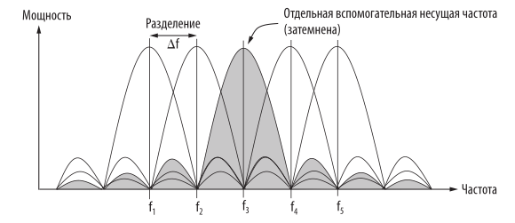
			- Чтобы это сработало, необходимо повторить часть сигналов, и эти издержки меньше, чем при большом количестве защитных полос.
		- ### Мультиплексирование по времени
			- **TDM (Time Division Multiplexing)**
			- 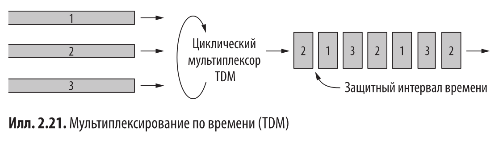{:height 273, :width 570}
		- ### Мультиплексирование с кодовым разделением каналов
		  collapsed:: true
			- **CDM (Code Division Multiplexing)** - узкополосный сигнал размывается по более широкой полосе, несколько сигналов могут использовать одну полосу частот.
			- Аналогия: предположим, много людей в толпе разговаривают парами
				- FDM - они разговаривают с разной высотой звука
				- TDM - они разговаривают по очереди
				- CDM - они разговаривают на разных языках
			- Каждый бит разбивается на m элементарных сигналов (то есть каждый бит кодируется другой битовой последовательностью).
			- Значит для передачи со скоростью b бит/сек нужна полоса mb.
			- FDM: если 100 станциям доступна полоса 1 МГц, то каждая получит свою полосу в 10 КГц -> 10 Кбит/сек
			- CDM: если 100 станциям доступна полоса 1 МГц, то каждая получает все 100 МГц, но на отправку 1 бита нужно 100 сигналов -> всё еще 10 Кбит/сек.
			- **КАК ЭТО РАБОТАЕТ:**
			- Пусть есть m станций, каждая кодирует бит "1" вектором $S$ из m элементарных сигналов, так, чтобы все эти векторы были попарно ортогональны. Бит "0" кодируется вектором $-S$.
			- Тогда если много станций в один момент отправили сигналы A, B, C, D, то мы получили сигнал A+B+C+D. Чтобы получить свой бит, нужно умножить полученный вектор на вектор своего бита "1".
			- Например:
				- $A = (+1, -1, -1, +1)$
				- $B = (+1, -1, +1, -1)$
				- $C = (+1, +1, +1, +1)$
				- $D = (-1, -1, -1, -1)$
				- Станции A и B послали бит "1", станция C послала бит "0", станция D ничего не послала.
				- Нам пришёл сигнал $A+B-C = (1, -3, -1, -1)$
				- Хотим узнать бит, который послала станция C:
				- $C*(A+B-C) = -C^2 = -4$ -> отрицательное -> был послан бит 0.
		- ### Мультиплексирование по длинам волн
			- Вид FDM для оптоволокна, когда несколько сигналов посылаются различными длинами волн света.
			-
- # 2.5 Коммутируемая телефонная сеть общего пользования
	-
- # 2.6 Сотовые сети
	-
- # 2.7 Кабельные сети
	-
- # 2.8 Спутники связи
	-
- # 2.9 Сравнение различных сетей доступа
	-
- # 2.10 Нормативное регулирование физического уровня
	-
-