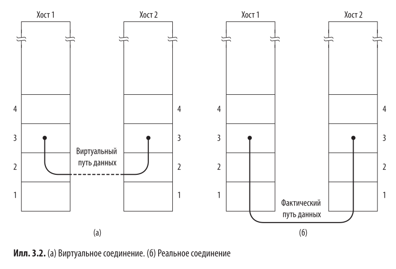
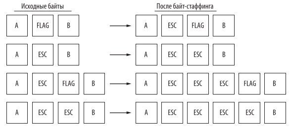
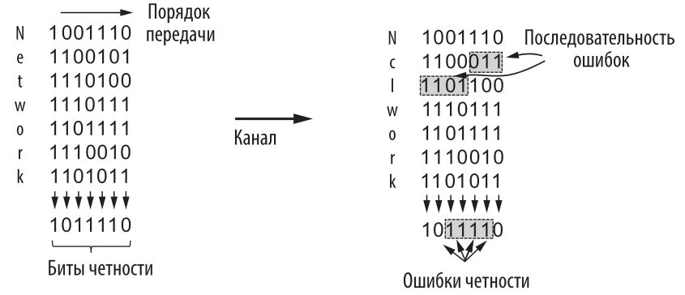
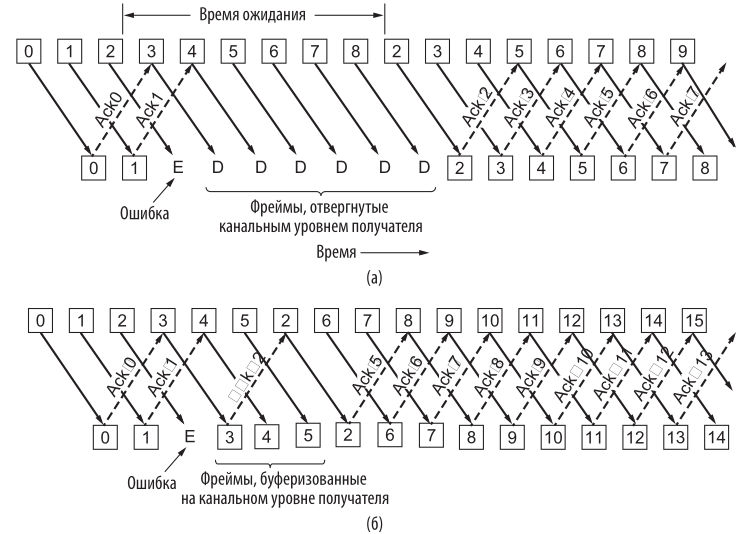

# 3.1 Ключевые вопросы проектирования канального уровня
	- Функции канального уровня:
	- - Обеспечение строго очерченного служебного интерфейса для сетевого уровня (раздел 3.1.1).
	- - Формирование отдельных фреймов из последовательностей байтов (раздел 3.1.2).
	- - Обнаружение и исправление ошибок передачи (раздел 3.1.3).
	- - Управление потоком данных, исключающее «затопление» медленных приемников быстрыми передатчиками (раздел 3.1.4).
	- Для этого канальный уровень вставляет пакеты в **фреймы (frames)**:
	- Header + Payload + Trailer
	- Управление фреймами - основная задача канального уровня.
	- ## 3.1.1 Службы, предоставляемые канальному уровню
		- Задача - получить пакет от сетевого уровня, передать по назначению, и передать обратно с канального на сетевой вверх.
		- {:height 508, :width 608}
		- Будем рассматривать модель на рисунке (а).
		- Возможные службы, предоставляемые канальным уровнем:
			- - Службы без подтверждения и без соединения
			- - Службы с подверждением, но без соединения
			- - Службы с подвертждением и соединением
		- Пример службы без подтверждения или соединения - Ethernet. Это хорошо при низком уровне ошибок.
		- Пример службы с подтверждением и без соединения - Wi-Fi. Беспроводные каналы ненадежны -> если не пришло подтверждение, отправляем снова. Такое решение - оптимизация, можно было бы сделать подтверждение на сетевом уровне, но на сетевом уровне пакеты большие, а на канальном фреймы маленькие -> ошибки восстанавливаются быстрее.
	- ## 3.1.2 Формирование фрейма
		- Физический уровень принимает поток битов и пытается их отправить, но он не застрахован от ошибок.
		- Канальный уровень должен их исправить.
		- Алгоритм - контрольная сумма: считаем некоторую сумму, добавляем её во фрейм, отправляем, получатель пересчитывает и сверяет. Если не совпало, посылает сообщение об ошибке.
		- Ещё одна задача - нормально разбить байтовый поток на фреймы.
		- Методы маркировки границ фреймов:
			- **1. Подсчёт байтов**:
				- Указываем в заголовке размер фрейма в байтах. Недостаток - если произошла ошибка, мы не знаем, где начала следующего фрейма.
			- **2. Флаговые байты с байт-стаффингом**:
				- Добавляем в начале и в конце специальный байт.
				- Проблема: в пользовательски данных какие-то байты могут совпасть с флаговым байтом.
				- Решение: перед отправкой пакета добавляем перед всеми байтами, совпадающими с флаговым, escape-символ. Канальный уровень получателя затем убирает эти символы перед передачей на сетевой уровень.
				- Ещё проблема: что если в пользовательских данных уже будет этот escape-символ?
				- Решение: перед escape-символом также вставляем escape-символ.
				- 
				- Это упрощенная модель протокола точка-точка **PPP (Point-to-Point Protocol)**.
			- **3. Использование сигнальных битов с бит-стаффингом:**
				- Фреймы произвольного рамера, делятся не по байтам, а по битам. В начале и в конце вставляем флаговые байты **01111110 (0x7E)**. Если в пользовательских данных встречается 5 единиц подряд, вставляем после них 0. Если принимающая сторона видит 111110 она заменяет это на 11111. Поэтому даже если в пользовательских данных встретилось 0111110, из этого получается 011111010, а принимающая сторона увидит 01111110.
			- **4. Использование запрещенных сигналов физического уровня:**
				- В линии 4B/5B используются не все 32 сигнала, а только 16. Для маркировки границ фрейма можно использовать неправильные сигналы.
		- Обычно используют различные сочетания этих методов.
	- ## 3.1.3 Обработка ошибок
		- Предположим, что получатель может определить, правильный он получил фрейм или нет. Для службы с подтверждением и соединением это недостаточно - нужно отправить обратно подверждающий фрейм.
		- Если подтверждающий фрейм потерялся - плохо.
		- Решение - отправитель засекает таймер, и если подверждающий фрейм не пришёл, то отправляем ещё раз.
		- Все фреймы нумеруем, чтобы получатель не получил один и тот же фрейм дважды.
		- Итого:
			- Если фрейм не доставлен, то мы просто отправляем его ещё раз.
			- Если фрейм доставлен успешно, но ответный фрейм потерялся, то мы думаем, что всё плохо и отправляем ещё один. Получатель получил два одинаковых, но они пронумерованы, поэтому норм.
	- ## 3.1.4 Управление потоком
		- Что делать с быстрым отправителем и медленным получателем?
		- Два способа:
			- **управление потоком с обратной связью (feedback-based flow control)** - отправитель сообщает о своём состоянии.
			- **управление потоком с ограничением (rate-based flow control)** - в протокол встраивается механизм, ограничивающий скорость отправки (это работает только на транспортном уровне - глава 5).
- # 3.2 Обнаружение и коррекция ошибок
	- Две стратегии:
		- **коды для обнаружения ошибок (error-detecting codes)** - используются в высоконадежных соединениях. Ошибок мало -> проще отправить ещё раз, чем исправлять.
		- **корректирующие коды (error-correcting codes)** - используются в ненадежных (в основном беспроводных) соединениях. Ошибки частые -> заебешься переотправлять, легче исправить.
	- ## 3.2.1 Корректирующие коды
		- Фрейм состоит из $m$ битов данных и $r$ корретирующих битов. Всего $n = m + r$.
		- Этот набор из $n$ бит называется кодовым словом. Кодовая норма $= m/n$.
		- Расстояние Хэмминга между двумя кодовыми словами = количество различающихся битов. Если между двумя словами расстояние $d$, то потребуется ровно $d$ ошибок, чтобы перевести одно в другое.
		-
		- Попробуем создать код, корректирующий одиночные ошибки. Каждому из $2^m$ сообщений должны соответствовать $n$ недопустимых слов и $1$ допустимое. Всего возможных слов $2^n$. Поэтому
		- $$(n+1)2^m < 2^n$$
		  $$m + r + 1 < 2^r$$
		- **1. Коды Хэмминга:**
			- Контрольные биты будут стоять на позициях 1, 2, 4, 8, 16, ...
			- Информационный биты - на всех остальных: 3, 5, 6, 7, 9, 10, 11, 12, ...
			- Каждый контрольный бит контролирует некоторую группу бит. Чтобы определить, в какую группу входит каждый бит, нужно разложить его на сумму степеней двойки.
				- Например, $11 = 8 + 2 + 1$ -> бит 11 будет контролироваться битами 1, 2 и 8
			- Значение контрольного бита $=(\sum\text{всех подконтрольных битов) mod } 2$.
			- **Декодирование** просходит следующим образом:
				- Пусть мы отправили слово 1000001. После кодирования получилось **00**1**0**000**1**001 (жирным отмечены контрольные биты).
				- Допустим, произошла ошибка в бите 5: **00**1**0**100**1**001.
				- Пересчитываем контрольные биты и получаем, что биты 1 и 4 не совпали -> ошибка в бите $1 + 4 = 5$.
		- **2. Сверточный код:**
			- Выходные биты зависят от текущего входного и от предыдущих.
			- Простейший пример: представляем наше сообщение в виде многочлена:
				- $$A(x) = a_0 + a_1x + a_2x^2 + a_3x^3 + a_4x^4 + a_5x^5 + a_6x^6 + ... $$
			- где $a_0, a_1, ...$ - биты входного сообщения
			- Выбираем два генерирущих многочлена для выходных битов, например $G_1(x) = 1$, $G_2(x) = 1 + x$.
			- Выходные биты будут генерироваться как $B_1(x) = A(x)G_1(x)$, $B_2(x) = A(x)G_2(x)$ и размещаются в каком-то порядке (например, чередуются).
			- В этом случае длина зашифрованного сообщения будет вдвое больше исходного, при этом в зашифрованном чередуются биты $a_i$ и $a_i + a_{i-1}$.
			- Например: сообщение A = 1000001. Первые выходные биты B1 = 1000001. Вторые выходные биты B2 = 1100001. Итоговое сообщение: 11010000000011.
			- **Декодирование:**
				- Пересчитываем B2. Если ошибка только в одном бите, то неправильным бит из B2. Если ошибка в двух битах, то неправильным пришёл бит из B1, который вошёл в оба бита из B2.
		- **3. Коды Рида-Соломона:**
			- Принцип действия: многочлен степени $n$ однозначно задаётся $n+1$ точкой -> добавляем излишнюю информацию, чтобы можно было восстановить многочлен всегда.
		- **4. LDCP (Low-Density Parity Check):**
			- Код представляется в виде матрицы и потом происходит какая-то аппроксимация.
	- ## 3.2.2 Коды для обнаружения ошибок
		- **1. Код с проверкой на четность:**
			- Добавляем в конец единственный бит четности. При декодировании проверяем, чтобы сумма всех битов всегда была четной.
			- Это позволяет обнаруживать единичные ошибки.
			- Результат можно улучшить:
			- {:height 314, :width 547}
		- **2. Контрольная сумма (checksum):**
			- Суммируем 16-битные слова, в конце сообщения вставляем их побитовое дополнение до нуля. Если сумма всех 16-битных слов сообщения = 0, то оно пришло без ошибок.
			- Проблема: нельзя отследить удаление или добавление нулевых данных.
			- Более эффективный алгоритм - **контрольная сумма Флетчера:** умножаем битовое слово на его позицию и складываем.
		- **3. Циклический избыточный код (Cyclic Redundancy Check):**
		  collapsed:: true
			- Рассматриваем битовые слова как коэффициенты многочлена.
			- Договариваемся об образующем многочлене $G(x)$, старший и младший биты которого равны 1.
			- Идея - добавить в конец фрейма $M(x)$ биты так, чтобы он без остатка делился на $G(x)$.
			- $M(x)$ должен быть длиннее $G(x)$.
			- **Алгоритм:**
				- 1) Пусть $r$ - степень $G(x)$, $m$ - степень $M(x)$. Добавим в конец фрейма $r$ нулевых битов, т.е. получим $x^rM(x)$.
				- 2) Разделим по модулю 2 битовую строку, соостоящую из коэффициентов $x^rM(x)$ на битовую строку, состоящую из коэффициентов $G(x)$.
				- 3) Вычтем по модулю 2 (побитово) остаток от деления.
			- **Пример:**
				- Пусть образующий многочлен $G(x) = x^4 + x + 1$, ему соответствует строка 10011.
				- Передаваемое сообщение M = 1101011111.
				- Дополняем M четырьмя нулями: 11010111110000.
				- Делим по модулю 2: то есть вместо вычитания используем XOR. Получаем остаток 10.
				- Вычитаем (побитово), получаем фрейм 110101111100010.
				- Полученный многочлен делится на $G(x)$ без остатка.
			- Некоторые многочлены стали международными стандартами, например в IEEE 802 применяется многочлен:
			- $$x^{32} + x^{26} + x^{23} + x^{22} + x^{16} + x^{12} + x^{11} + x^{10} + x^8 + x^7 + x^5 + x^4 + x^2 + x + 1$$
			- Ему соответствует слово 1 0000 0100 1100 0001 0001 1101 1011 0111
- # 3.3 Элементарные протоколы передачи данных на канальном уровне
	- ## 3.3.1 Исходные упрощающие допущения
		- Предполагаем, что физический, канальный и сетевой уровни - независимые процессы, взаимодействующие между собой путем передачи сообщений.
		- **NIC (Network Interface Card)** -  отвечает за физический уровень + часть канального
		- **CPU** - остальная часть канального уровня.
		- Предполагаем, что мы отправляем большой поток данных по надежной службе с соединением.
		- Предполагаем, что компьютеры не выходят из строя.
	- ## 3.3.2 Базовая схема передачи и приема данных
		- [это всё не по настоящему если чё, это просто псевдокод на си](это не ссылка долбаеб)
		- Канальный уровень получает пакет от сетевого уровня, добавляет заголовок и трейлер, затем передаёт канальному уровню целевого устройства. Целевое устройство вычисляет чек-сумму.
		- Изначально получатель ничего не делает, просто ждёт. Будем обозначать это функцией ``wait_for_event(&event);``
		- Получение и передачу на физический уровень будем обозначать функциями типа ``from_physical_layer`` и ``to_physical_layer``.
		- Основные объявления на языке С:
		- Тут пока не всё понятно. Что такое ``ack``, ``nak``, ``enable_network_layer``, ``disable_network_layer`` - позже
		- ``` protocol.h
		  #define MAX_PKT 1024 // max size of packet
		  #define INC(k) if (k < MAX_SEQ) k++; else k = 0 // increment mod MAX_SEQ
		  
		  typedef enum {false, true} boolean;
		  typedef unsignet int seq_nr; // number of frame
		  
		  typedef struct {unsigned char data[NAX_PKT]; } packet;
		  typedef enum (data, ack, nak) frame_kind; 
		  
		  typedef struct 
		  {
		  	frame_kind kind;
		      seq_nr seq;
		      seq_nr ack; // number of acknowledgement
		      packet info;
		  } frame;
		  
		  void wait_for_event(event_type *event);
		  
		  void from_network_layer(packet *p);
		  void to_network_layer(packet *p);
		  
		  void from_physical_layer(frame *r);
		  void to_physical_layer(frame *s);
		  
		  void start_timer(seq_nr k);
		  void stop_timer(seq_nr k);
		  
		  void start_ack_timer();
		  void stop_ack_timer();
		  
		  void enable_network_layer();
		  void disable_network_layer();
		  ```
	-
	- ## 3.3.2 Симплексные протоколы канального уровня
		- ### Протокол "утопия": без управления потоком и без исправления ошибок
			- Две процедуры - sender1 и reciever1.
			- Номера фреймов и номера подтверждения не используются.
			- ```
			  #include "protocol.h"
			  
			  void sender1()
			  {
			  	frame s;
			      packet buffer;
			      while (true)
			      {
			      	from_network_layer(&buffer);
			          s.info = buffer;
			          to_physical_layer(&s);
			      }
			  }
			  
			  void reciever1()
			  {
			  	frame r;
			      event_type event;
			      
			      while (true)
			      {
			      	wait_for_event(&event);
			          
			          from_physical_layer(&r);
			          to_network_layer(&r.info);
			      }
			  }
			  ```
		- ### Добавляем управление потоком: протокол с остановкой и ожиданием
			- Отправитель ждёт ответного фрейма от получателя, что всё ок, чтобы не перегружать его.
			- ```
			  #include "protocol.h"
			  
			  void sender2()
			  {
			  	frame s;
			      packet buffer;
			      while (true)
			      {
			      	from_network_layer(&buffer);
			          s.info = buffer;
			          to_physical_layer(&s);
			      }
			  }
			  
			  void reciever2()
			  {
			  	frame r, s;
			      event_type event;
			      
			      while (true)
			      {
			      	wait_for_event(&event);
			          
			          from_physical_layer(&r);
			          to_network_layer(&r.info);
			          to_physical_layer(&s);
			      }
			  }
			  ```
	- ### Добавляем исправление ошибок: порядковые номера и протокол ARQ
		- Может показаться, что можно улучшить предыдущий протокол, добавив отправителю таймер: ответка не пришла до таймаута - отправляем ещё раз.
		- Проблема - сетевой уровень не может распознать потерю или дублирование, поэтому канальный уровень должен гарантировать отсутствие повторов.
		- Решение - нумерация фреймов.
		- ```
		  #define MAX_SEQ 1 // чередуем фрейм 0 и фрейм 1
		  #include "protocol.h"
		  typedef enum {frame_arrival, cksum_err, timeout} event_type;
		  
		  void sender3()
		  {
		  	seq_nr next_frame_to_send;
		  	frame s;
		      packet buffer;
		      event_type event;
		      
		      next_frame_to_send = 0;
		      from_network_layer(&buffer);
		      while (true)
		      {
		          s.info = buffer;
		          s.seq = next_frame_to_send;
		          to_physical_layer(&s);
		          
		          start_timer(s.seq);
		          wait_for_event(&event); // waiting for acknowledgement
		          if (event == frame_arrival)
		          {
		          	from_physycal_layer(&s); // get acknowledgement
		              if (s.ack != next_frame_to_send) // if wrong acknowledgment, repeat sending
		              	continue;
		              
		              stop_timer(s.ack);
		              from_network_layer(&buffer); // get next message
		              INC(next_frame_to_send); // increment
		          }
		      }
		  }
		  
		  void reciever3()
		  {
		  	seq_nr frame_expected;
		  	frame r, s;
		      event_type event;
		      
		      frame_expected;
		      while (true)
		      {
		      	wait_for_event(&event);
		          if (event != frame_arrival) // if checksum error, send no acknowledgment, wait again
		          	continue;
		          
		          from_physical_layer(&r); // get frame
		          if (r.seq == frame_expected)
		          {
		          	to_network_layer(&r.info);
		              INC(frame_expected); // increment
		          }
		          
		          s.ack = 1 - frame_expected;
		          to_physical_layer(&s); // send acknowledgment
		      }
		  }
		  ```
- # 3.4 Повышение эффективности
	- ## 3.4.1 Цель: двунаправленная передача, отправка сразу нескольких фреймов
		- ### Вложенное подтверждение
			- В прошлом примере один канал - основной, второй - для подтверждений и почти не используется.
			- Идея - использовать один канал и отправлять по нему фреймы разных типов (kind), по которому можно будет отличить подтверждающий фрейм от фрейма с сообщением.
			- Можно также не отправлять подтверждение сразу, а дождаться следующего сообщения с сетевого уровня и включить в него поле ``ack`` - так эффективнее (креветки круто).
			- Проблема - не знаем сколько ждать пакет с сетевого уровня.
			- Решение - устанавливаем ещё один интервал ожидания.
		- ### Раздвижное окно
			- **sliding window** - класс протоколов.
			- Каждый фрейм содержит порядковый номер. Храним окно - два числа - последнее подтвержденное (минимум окна) и последнее отправленное (максимум окна).
			- Храним все фреймы, входящие в окно, для возможной переотправки.
	- ## 3.4.2 Примеры дуплексных протоколов раздвижного окна
		- ###  Однобитовое раздвижное окно
			- ```
			  #define MAX_SEQ 1
			  #include "protocol.h"
			  
			  typedef enum {frame_arrival, cksum_err, timeout} event_type;
			  
			  void protocol4()
			  {
			  	seq_nr next_frame_to_send;
			      seq_nr frame_expected;
			      frame r, s;
			      packet buffer;
			      event_type event;
			      
			      next_frame_to_send = 0;
			      frame_expected = 0;
			      from_network_layer(&buffer);
			         
			      while (true)
			      {
			          s.info = buffer;
			          s.seq = next_frame_to_send;
			          s.ack = 1 - frame_expected;
			          to_physical_layer(&s);
			          start_timer(s.seq);
			   
			      	wait_for_event(&event); // wait for packet
			          
			          if (event != frame_arrival) // handle timeout and cksum_err
			          	continue;
			          
			          from_physical_layer(&r); // recieve packet
			          if (r.seq == frame_expected) // if good, pass packet to network layer
			          {
			          	to_network_layer(&r.info);
			              INC(frame_expected);
			          }
			          
			          if (r.ack = next_frame_to_send) // process sended packet
			          {
			          	stop_timer(r.ack);
			              from_network_layer(&buffer);
			              INC(next_frame_to_send);
			          }
			      }
			  }
			  ```
		- ### Протокол с возвратом к n
			- Время на отправку может быть сильно больше времени на вычисления на процессоре - процесс всё время заблокирован - проблема эффективности.
			- Это - следствие правила, по которому отправитель обязан дождаться подтверждения перед отправкой следующего фрейма.
			- Нужно разрешить отправлять $\omega$ фреймов перед тем, как ждать их подтверждения.
			- Чтобы найти необходимое $\omega$ необходимо знать, сколько фреймов помещается в канал (емкость канала).
			- $$\text{Емкость} = \text{[ полоса пропускания (бит/сек) ]} * \text{[ время пересылки в одну сторону (сек) ]} = BD$$
			- B - bandwidth, D - delay.
			- Тогда
			- $$\omega = 2BD + 1$$
			- Умножаем на 2 потому что пакеты идут в обе стороны.
			- **Пример:**
				- Полоса - 50Кбит/сек.
				- Пересылка - 250 мс.
				- BD = 12.5 Кбит (12.5 фреймов по 1000 бит).
				- 2BD + 1 = 26 фреймов можно отправлять перед ожиданием подтверждения.
				- Макс. размер окна = 26.
			- Что делать, если посередине возникла ошибка? На сетевой уровень фреймы должны приходить в строго определенном порядке.
			- Два способа:
			- а) **Возврат к n:** у нас маленькое окно, поэтому если получили ошибку, отклоняем все последующие фреймы в конвейере, и просим их все заного.
			  б) **Выборочный повтор:** у нас большое окно, поэтому если получили ошибку, запоминаем в буфер все последующие фреймы в конвейере, просим заного тот, что с ошибкой, а потом восстанавливаем порядок.
			- {:height 467, :width 576}
		- ### Выборочный повтор
			- Стратегия - если пришёл фрейм с ошибкой, запоминаем все последующие, а потом запрашиваем новый.
			- Выборочный повтор часто комбинируется с отправкой негативного подтверждения (**NAK**) - посылаем при ошибке или при неправильном порядке фреймов.
			- Если не послать NAK, то отправитель сам отправит фрейм заново, когда истечет таймер, но это может быть сильно дольше.
			- Этот код работает чисто на предположении, что есть обратный трафик, т.к. специально получатель никакие подтверждения не отправляет. Это исправлено в протоколе 6.
			- ```
			  #define MAX_SEQ 7 // window width = 7
			  
			  #include "protocol.h"
			  
			  // check if a <= b < c cyclically
			  static bool 
			  between(seq_nr a, seq_nr b, seq_nr c)
			  {
			  	return ((a <= b) && (b < c)) || ((c < a) && (a <= b)) || ((b < c) && (c < a));
			  }
			  
			  static void
			  send_data(seq_nr frame_nr, seq_nr frame_expected, packet buffer[])
			  {
			  	frame s;
			      s.info = buffer[frame_nr];
			      s.seq = frame_nr;
			      s.ack = (frame_expected + MAX_SEQ) % (MAX_SEQ + 1);
			      
			      to_physical_layer(&s);
			      start_timer(frame_nr);
			  }
			  
			  void protocol5()
			  {
			  	seq_nr next_frame_to_send;
			      seq_nr ack_expected; // oldest unacknowledged frame
			      seq_nr frame_expected;
			      frame r;
			      packet buffer[MAX_SEQ + 1];
			      seq_nr nbuffered;
			      
			      seq_nr i; // index for buffer array
			      event_type event;
			      enable_network_layer(); // enable events of type network_layer_ready
			      ack_expected = 0;
			      next_frame_to_send = 0;
			      frame_expected = 0;
			      nbuffered = 0;
			      
			      while (true)
			      {
			      	wait_for_event(&event);
			          switch (event)
			          {
			          // network layer holds a packet -> send it
			          case network_layer_ready: 
			          	from_network_layer(&buffer[next_frame_to_send]);
			              nbuffered++;
			              send_data(next_frame_to_send, frame_expected, buffer);
			              INC(next_frame_to_send);
			              break;
			  	
			      	// accept frame
			          case frame_arrival;
			          	from_physical_layer(&r);
			              if (r.seq == frame_expected)
			              {
			              	to_network_layer(&r.info);
			                  INC(frame_expected);
			              }
			              while (between(ack_expected, r.ack, next_frame_to_send))
			              {
			              	nbuffered--;
			                  stop_timer(ack_expected);
			                  INC(ack_expected);
			              }
			            	break;
			          
			          case cksum_err:
			          	break;
			           
			          // no acknowledgement -> resend
			          case timeout:
			          	next_frame_to_send = ack_expected;
			              for (i = 1; i < nbuffered; i++)
			              {
			              	send_data(next_frame_to_send, frame_expected, buffer);
			                  INC(next_frame_to_send);
			              }
			          } // switch (event)
			          
			          if (nbuffered < MAX_SEQ)
			          	enable_network_layer();
			          else
			          	disable_network_layer();
			      } // while (true)
			  } // void protocol5()
			  
			  ```
			- Допустим, отправитель посылает 7 фреймов (с 0 по 6). Получатель их получает без ошибок, и когда он будет посылать ответки его окно (от ack_expected до next_frame_to_send) сместиться для приема фреймов 7, 0, 1, 2, 3, 4, 5 (картинка б).
			- Допустим, произошла беда, и ответки не дошли. Отправитель не получил ответку и заново отправляет фрейм 0. Фрейм 0 входит в окно получателя и принимается за новый фрейм. Из-за этого там всё ломатеся с подтверждениями (я не понял, какую именно проблему имеет ввиду Танненбаум, этот пример  целом инвалидский и не работает по многим причинам).
		- ### Окно - половина от количества порядковых номеров
			- Делаем окно размером $(MAX\_SEQ + 1)/2$ чтобы окна не накладывались и можно было всегда отличить повторную отправку старых фреймов от новых фреймов.
			- ```
			  #define MAX_SEQ 7
			  #define NR_BUFS ((MAX_SEQ + 1) / 2)
			  
			  typedef enum {
			  	frame_arrival, cksum_error, timeout, network_layer_ready, ack_timeout
			  } event_type;
			  
			  #include "protocol.h"
			  
			  bool no_nak = true; // negative acknowledgement haven't been send yet
			  seq_nr  oldest_frame = MAX_SEQ + 1; // init value
			  
			  // check if a <= b < c cyclically
			  static bool 
			  between(seq_nr a, seq_nr b, seq_nr c)
			  {
			  	return ((a <= b) && (b < c)) || ((c < a) && (a <= b)) || ((b < c) && (c < a));
			  }
			  
			  // same as in example 5, but different
			  static void 
			  send_frame(frame_kind fk, seq_nr frame_nr, seq_nr frame_expected, packet buffer[])
			  {
			  	frame s;
			      s.kind = fk;
			      if (fk == data)
			      	s.info = buffer[frame_nr % NR_BUFS];
			      s.seq = frame_nr;
			      s.ack = (frame_expected + MAX_SEQ) % (MAX_SEQ + 1); // acknowledge previous frame
			     	
			      if (fk == nak)
			      	no_nak = false;
			      
			      to_physical_layer(&s);
			      
			      if (fk == data)
			      	start_timer(frame_nr % NR_BUFS);
			      stop_ack_timer(); // prevent sending of distinct frame only for acknowledgement by timeout
			  }
			  
			  void 
			  protocol6()
			  {
			  	seq_nr ack_expected;       // lower bound of sender window
			      seq_nr next_frame_to_send; // upper bound of sender window + 1
			      seq_nr frame_expected;     // lower bound of reciever window
			      seq_nr too_far;            // upper bound of reciever window + 1
			      
			      int i;  // buffer array index
			      frame r;
			      
			      packet out_buf[NR_BUFS]; // buffer for outcoming thread (keep for resending)
			      packet in_buf[NR_BUFS]; // buffer for incoming thread (keep while waiting for others)
			      
			      bool arrived[NR_BUFS];
			      
			      seq_nr nbuffered; // number of outcoming buffers in use (out window width)
			      
			      event_type event;
			      enable_network_layer(); // enable events of type network_layer_ready
			      
			      ack_expected = 0; // number of next acknowledgement expected
			      next_frame_to_send = 0;
			      frame_expected = 0;
			      too_far = NR_BUFS;
			      nbuffered = 0;
			      
			      for (int j = 0; j < NR_BUFS; j++)
			      	arrived[j] = false;
			      
			      while (true)
			      {
			      	wait_for_event(&event);
			          switch(event)
			          {
			          // just sending
			         	case  network_layer_ready:
			          	nbuffered++;
			              from_network_layer(&out_buf[next_frame_to_send % NR_BUFS]);
			              send_frame(frame_kind.data, next_frame_to_send, frame_expected, out_buf);
			              INC(next_frame_to_send);
			          	break;
			          
			          // this is the brainfucking case
			          case frame_arrival:
			          	from_physical_layer(&r);
			              if (r.kind == data)
			              {
			           		if ((r.seq != frame_expected) && no_nak)
			                  	send_frame(frame_kind.nak, 0, frame_expected, out_buf);
			                  else
			                  	start_ack_timer();
			                      
			                  if (between(frame_expected, r.seq, too_far) && !arrived[r.seq % NR_BUFS])
			                  {
			                  	arrived[r.seq % NR_BUFS] = true;
			                      in_buf[r.seq % NR_BUFS] = r.info;
			                      
			                      while (arrived[frame_expected % NR_BUFS])
			                      {
			                      	to_network_layer(&in_buf[frame_expected % NR_BUFS]);
			                          no_nak = true;
			                          arrived[frame_expected % NR_BUFS] = false;
			                          INC(frame_expected);
			                          INC(too_far);
			                          start_ack_timer();
			                      }
			                  }
			              }
			              
			              if ((r.kind == nak) && between(ack_expected, (r.ack + 1) % (MAX_SEQ + 1), next_frame_to_send))
			              {
			              	send_frame(frame_kind.data, (r.ack + 1) % (MAX_SEQ + 1), frame_expected, out_buf);
			                  while (between(ack_expected, r.ack, next_frame_to_send))
			                  {
			                  	nbuffered++;
			                      stop_timer(ack_expected % NR_BUFS);
			                      INC(ack_expected);
			                  }
			              }
			          	break;
			              
			          case cksum_err:
			          	break;
			              
			          case timeout:
			          	send_frame(data, oldest_frame, frame_expected, out_buf);
			          	break;
			              
			          case ack_timeout:
			  			send_frame(ack, 0, frame_expected, out_buf);
			          } // switch (event)
			          
			          if (nbuffered < NR_BUFS)
			          	enable_network_layer();
			          else
			          	disable_network_Layer();
			      } // while (true)
			  } // protocol6()
			  ```
			-
			-
- # 3.5 Практическое использование протоколов канального уровня
	- Три канала - SONET, ADSL, DOCSIS
	- ## 3.5.1 Передача пакетов по каналам SONET
		-